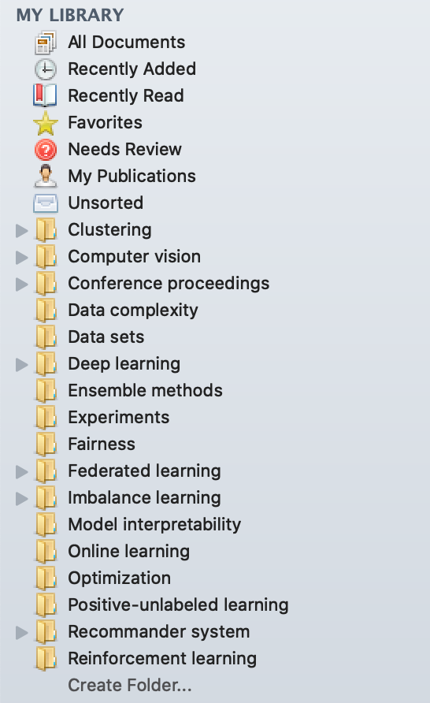

这是一份我自己做研究的心得，适用于准备开始做研究的你，希望对你有些帮助。

## 知识整理

无论是日常学习还是做研究，都会有很多知识点。人的大脑容量有限，没办法一直记得某个知识点。这时候就需要一份自己的知识库的文档。一方面是看过的内容自己写出来会加深理解，看懂了和能够把看懂的东西写出来完全是两回事。另一方面是过一段时间一些知识忘记了，再回过头来看自己写的东西很快就能记起来，不需要再去翻书或者资料，而且有些东西看完甚至都不记得是在哪里看的了。

比如说你的研究领域会用到CNN（卷积神经网络），那么就可以在文档中专门整理一块关于CNN的内容，可以包括CNN的基本模型结构、起源、优缺点、通常用于解决什么问题、比较有效的几种改进方式、最新研究进展等等。

这份文档需要持续更新和维护，随着你学的内容增加，也会有一些新的理解，可以持续往里面加内容，有时候看到一些新的内容发现自己以前理解的是错的，也可以随时进行修正。同时也可以使用DAG（有向无环图）或者思维导图来帮助整理文献之间的种类与关系，例如某几篇文章是属于同一类方法，或者文章之间的依赖关系。这样对文章之间的关系脉络，以及整个方法种类会更加清晰。

## 文献

### 读论文

首先推荐[吴恩达教你读论文](https://www.youtube.com/watch?v=733m6qBH-jI)，在他的方法之上，我建议对当前的研究方向整理一个文档。这份文档是针对论文的，和上面那个知识整理的文档侧重点不一样。文档记录了你看完觉得有价值的论文，结合吴恩达视频中强调的看完论文应该知道的几点，我认为应该记录：

1. 这篇论文的动机是什么？（Motivation）

   一篇好的论文一定会有一个很明确的动机，在这个动机之上，明确该论文要解决的问题，之后再提出相应的创新方法来解决该问题。动机可以是：之前的工作没能够完美解决某个问题吗？之前的工作在算法设计上有哪些缺陷，导致了什么问题？之前的工作没考虑到问题中的某些因素，或者在某种条件下会导致失败？某个问题是否有一些特殊情况当前的方法解决不了？等等。

2. 这篇论文要解决的问题是什么？作者想要达到什么目的？（Problem）

   要注意动机和问题是不同的，动机是这篇文章存在的意义，以及为什么有价值的地方。问题是更具体的需要使用提出的方法解决的东西。例如一篇文章的动机是：当前最好的方法A由于其模型的构造，导致在某个场景下对噪声十分敏感，从而最终预测精度大幅下降。相对应的问题是：如何有效提出一种对噪声鲁棒的新算法。

3. 提出的新方法的主要创新点以及优点在哪里？有哪些核心要素？（Advantages）

   这个是比较好发现的，因为作者会在通篇多次强调创新点和优点在哪里。但是需要学会如何分辨真正的闪光点和吹的闪光点。

4. 提出的新方法有哪些不足之处或者明显缺点？（Disdvantages）

   这个是作者在论文中绝对不会讨论的，但是每篇论文都会有瑕疵，每个方法都会有缺点。有些缺点是作者心知肚明的，他们在写作过程中都会极力隐藏这些点，也有一些缺点是作者确实没想到的。科研新手，或者是老手第一次读一篇论文可能很难察觉到缺点，不过在对一个领域有较深入的了解后通常会比较容易发现。此外，在引用该论文的论文中也可以找到一些对该论文缺点的讨论（毕竟不说别人不好，怎么能突出自己好呢）。

这份文档也是需要长期维护的，有些论文可能看完之后没太看懂或者没什么想法，但是在之后别的论文中看到别人提到或是点评了这篇论文之后一下子明白了，都可以把相关的思考和心得记录在这个文档中。这样当你不记得一篇论文的核心思想的时候，就不用再去看那篇论文，直接看文档中自己的记录就好了。有时候过一段时间再看一遍论文又会有新的理解，这些都可以更新在这份文档中。这份文档的论文分类可以与Mendeley保持一致，方便整理。

其次，读论文不像看书，不需要按顺序从头到尾看，一般读论文读完摘要之后就可以跳着看，先挑感兴趣的地方看，然后再对不理解的地方研究一下。只有是和当前研究方向密切相关的论文才需要一字一句的精读，思考作者每一部分想表达的内容。

### 搜索文献

搜索文献的工具有很多，但是我认为Google Scholar就足够了，唯一的缺点就是要科学上网（或者使用谷歌助手）。通常如果读到一篇感兴趣的论文，想通过这篇论文查看跟其相关的工作，通常有两种方法：

1. 最直接的方法就是去看他引用的文章。一般都会引用近期比较知名的综述文章或者该文章主要对比的state-of-the-art（SOTA）文章。
2. 如果这篇文章不是这几个月才发表的，还可以去Google Scholar上搜索引用这篇文章的文章，然后按照引用量排序进行查看。

#### 如何鉴别文章好坏

1. 首先是看文章发表的刊物。在机器学习和人工智能领域，顶级期刊有TPAMI，JMLR，IJCV等，顶级会议有NIPS，ICML，ICLR，CVPR，ICCV ，AAAI，IJCAI等。
   * 期刊通常使用中科院JCR分区进行分类，具体分类可以在[LetPub](http://www.letpub.com.cn/index.php?page=journalapp)上查到。一般1区的期刊都是比较好的。
   * 会议通常参考[CCF推荐](https://www.ccf.org.cn/ccf/contentcore/resource/download?ID=99202)，CCF A类会议也就是我们通常说的顶会。计算机领域会议的工作通常分量也很重，而且时效性高。因为期刊的审稿周期较长，当你看到期刊文章发表的时候，这个idea一般已经是2年前作者想出来的了。而会议文章则代表了当前领域最新最前沿的研究。
   * 此外，arXiv是一个未经同行评议，作者可以自己将论文草稿上传的预印本网站，上面挂了大量没有发表的文章。多数顶会顶刊文章在发表之前都会挂在arXiv上，但是其中也充斥着大量水文和占坑文章，新手不是特别容易鉴别，不建议一开始就去看arXiv上的文章。
2. 看引用数。引用数直接决定了一篇文章的影响力。一般一篇文章如果在发表之后的1年内引用数超过100，那么这篇文章就已经是相当有分量的文章了，可以仔细阅读一下。相反如果一篇文章发表1年之后还没人引用，那么尽管这篇文章可能是发表在顶会或顶刊上，可能其影响力就比较有限。不然是内容太深奥了没人看得懂，不然是内容太水了没有参考价值。

## 编程语言

1. 目前人工智能领域主流编程语言仍然是Python，多数论文的源代码都是用Python编写的。掌握Python的基本语法，以及常用的扩展包如numpy，pandas，sklearn即可。
2. 目前的主流深度学习框架是TensorFlow和PyTorch，我建议两者都要会。对于科研来说使用PyTorch的可能会更多一些，因为对于算法实现更加容易，而TensorFlow因为有较多部署的模块，所以在工业界使用较多。入门可以在看完基本用法之后直接找一篇有公开源代码的文章，把代码载下来读懂并成功运行，这样很快就能入门并且在别人的代码基础上进行改进。
3. PyCharm是Python最流行的IDE，功能强大，调试代码十分方便，必须掌握。
4. Jupyter Notebook是一个很方便的交互式编程界面，可以将代码、实验结果、画图、文档全部放在一起，建议掌握。

在公司进行大型工程项目的时候需要对编程语言十分精通，但是在科研阶段并不需要，只要会用，够用就行。毕竟编程语言只是辅助你进行实验，证明你的想法的一个**工具**而已。

## 论文写作

### LaTex

LaTex是一种论文编辑排版工具，目前所有的科技论文都是由LaTex写出来的（通常只有野鸡刊物上的垃圾论文是用word写的）。LaTex功能非常强大，使用熟练后编辑论文很方便，也很美观。入门建议学习[一份不太简短的LaTex2$\epsilon$介绍](http://www.ptep-online.com/ctan/lshort_chinese.pdf)

### linggle

[linggle](https://linggle.com/)是一个查英文短语或短句出现频率的网站，例如当你不确定你的动词后面用on, at还是in，就可以上去看看哪种组合出现的频率高，而且还有参考例句。

## 其他工具

### Mendeley

由于我们需要阅读大量的学术论文，Mendeley可以将论文分类并且保存，还可以同步到云端使各设备上的论文库保持同步，很方便。这是我的Mendeley对论文的分类：

除了Mendeley之外，也有一些其他的论文管理工具，都可以试试，觉得哪个好用就用哪个，不局限于Mendeley。

### GitHub

GitHub上有大量开源代码，可以用于复现以及改进。通常我们的工作没有必要从头开始实现，可以在别人的代码框架上进行修改。GitHub是基于git的，可以使用git的一些指令进行版本控制，将代码托管在GitHub上十分方便。不熟悉指令也可以使用桌面版，也很方便。

此外，计算机类的论文通常需要跑代码做实验，如果作者将可完美复现论文中实验结果的代码在递交论文时附上链接的话，论文实验的可信度会很大程度上提高，从而提高论文的接受率。所以我建议尽可能在递交论文时附上代码链接。如果是期刊文章可以直接挂github链接，会议双盲审稿的通常会将代码挂在一个匿名网盘上。

### Markdown

Markdown是一种轻量级标记语言，它允许人们使用易读易写的纯文本格式编写文档，然后有效转化成html或者pdf文档。例如，GitHub中的README.md会自动将文档中的内容以html的形式显示在该repo的主页面上。Markdown中有层次明确的heading和与LaTex相同的数学编辑工具。在Markdown里敲的公式可以在今后轻易复制到LaTex中，很方便。我自己使用Typora进行Markdown编辑，也有很多其他的软件可以使用。我建议知识整理文档和论文整理文档都使用Markdown，当然如果你觉得没有word好用或者不嫌麻烦用LaTex写文档，那也ok。